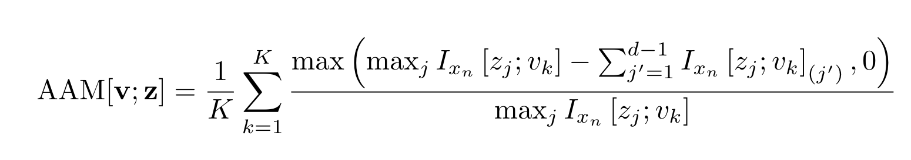
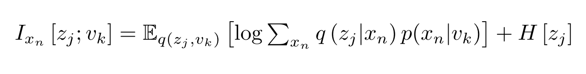
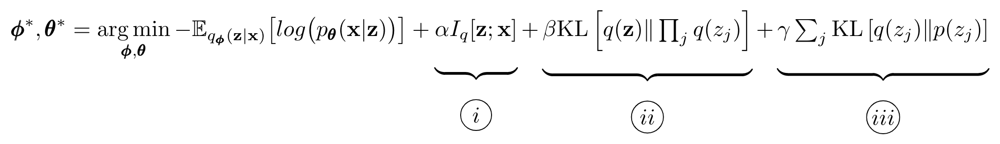

# Disentangled VAE 

Work In Progress...

This repository contains code to investigate disentangling in VAE as well as compare 5 different losses ([summary of the differences](#loss-overview)) using the same model:

* **Standard VAE Loss** from [Auto-Encoding Variational Bayes](https://arxiv.org/abs/1312.6114)
* **β-VAE<sub>H</sub>** from [β-VAE: Learning Basic Visual Concepts with a Constrained Variational Framework](https://openreview.net/pdf?id=Sy2fzU9gl)
* **β-VAE<sub>B</sub>** from [Understanding disentangling in β-VAE](https://arxiv.org/abs/1804.03599)
* **FactorVAE** from [Disentangling by Factorising](https://arxiv.org/pdf/1802.05983.pdf)
* **β-TCVAE** from [Isolating Sources of Disentanglement in Variational Autoencoders](https://arxiv.org/abs/1802.04942)

Notes:
- Tested for python >= 3.6
- Tested for CPU and GPU

## Install

```
# clone repo
pip install -r requirements.txt
```

## Run

Use `python main.py <saving-name> <param>` to train and/or evaluate a model. 

### Output
This will create a directory `results/<saving-name>/` which will contain:

* **model.pt**: The model at the end of training. 
* **model-**`i`**.pt**: Model checkpoint after `i` iterations. By default saves every 10.
* **specs.json**: The parameters used to run the program (default and modified with CLI).
* **training.gif**: GIF of latent traversals of the latent dimensions Z at every epoch of training.
* **train_losses.log**: All (sub-)losses computed during training.
* **test_losses.log**: All (sub-)losses computed at the end of training with the model in evaluate mode (no sampling). 
* **metrics.log**: [Mutual Information Gap](https://arxiv.org/abs/1802.04942) metric and [Axis Alignment Metric](#axis-alignment-metric). Only if `--is-metric` (slow).


### Help
```
usage: main.py [-h] [-L {CRITICAL,ERROR,WARNING,INFO,DEBUG,NOTSET}]
               [--no-progress-bar] [--no-cuda] [-s SEED]
               [--checkpoint-every CHECKPOINT_EVERY]
               [-d {mnist,fashion,dsprites,celeba,chairs}]
               [-x {custom,debug,best_celeba,VAE_mnist,VAE_fashion,VAE_dsprites,VAE_celeba,VAE_chairs,betaH_mnist,betaH_fashion,betaH_dsprites,betaH_celeba,betaH_chairs,betaB_mnist,betaB_fashion,betaB_dsprites,betaB_celeba,betaB_chairs,factor_mnist,factor_fashion,factor_dsprites,factor_celeba,factor_chairs,btcvae_mnist,btcvae_fashion,btcvae_dsprites,btcvae_celeba,btcvae_chairs}]
               [-e EPOCHS] [-b BATCH_SIZE] [--lr LR] [-m {Burgess}]
               [-z LATENT_DIM] [-l {VAE,betaH,betaB,factor,btcvae}]
               [-r {bernoulli,laplace,gaussian}] [-a REG_ANNEAL]
               [--betaH-B BETAH_B] [--betaB-initC BETAB_INITC]
               [--betaB-finC BETAB_FINC] [--betaB-G BETAB_G]
               [--factor-G FACTOR_G] [--lr-disc LR_DISC]
               [--btcvae-A BTCVAE_A] [--btcvae-G BTCVAE_G]
               [--btcvae-B BTCVAE_B] [--is-eval-only] [--is-metrics]
               [--no-test] [--eval-batchsize EVAL_BATCHSIZE]
               name

PyTorch implementation and evaluation of disentangled Variational AutoEncoders
and metrics.

optional arguments:
  -h, --help            show this help message and exit

General options:
  name                  Name of the model for storing or loading purposes.
  -L, --log-level {CRITICAL,ERROR,WARNING,INFO,DEBUG,NOTSET}
                        Logging levels. (default: info)
  --no-progress-bar     Disables progress bar. (default: False)
  --no-cuda             Disables CUDA training, even when have one. (default:
                        False)
  -s, --seed SEED       Random seed. Can be `None` for stochastic behavior.
                        (default: 1234)

Training specific options:
  --checkpoint-every CHECKPOINT_EVERY
                        Save a checkpoint of the trained model every n epoch.
                        (default: 30)
  -d, --dataset {mnist,fashion,dsprites,celeba,chairs}
                        Path to training data. (default: mnist)
  -x, --experiment {custom,debug,best_celeba,VAE_mnist,VAE_fashion,VAE_dsprites,VAE_celeba,VAE_chairs,betaH_mnist,betaH_fashion,betaH_dsprites,betaH_celeba,betaH_chairs,betaB_mnist,betaB_fashion,betaB_dsprites,betaB_celeba,betaB_chairs,factor_mnist,factor_fashion,factor_dsprites,factor_celeba,factor_chairs,btcvae_mnist,btcvae_fashion,btcvae_dsprites,btcvae_celeba,btcvae_chairs}
                        Predefined experiments to run. If not `custom` this
                        will overwrite some other arguments. (default: custom)
  -e, --epochs EPOCHS   Maximum number of epochs to run for. (default: 100)
  -b, --batch-size BATCH_SIZE
                        Batch size for training. (default: 64)
  --lr LR               Learning rate. (default: 0.0005)

Model specfic options:
  -m, --model-type {Burgess}
                        Type of encoder and decoder to use. (default: Burgess)
  -z, --latent-dim LATENT_DIM
                        Dimension of the latent variable. (default: 10)
  -l, --loss {VAE,betaH,betaB,factor,btcvae}
                        Type of VAE loss function to use. (default: betaB)
  -r, --rec-dist {bernoulli,laplace,gaussian}
                        Form of the likelihood ot use for each pixel.
                        (default: bernoulli)
  -a, --reg-anneal REG_ANNEAL
                        Number of annealing steps where gradually adding the
                        regularisation. What is annealed is specific to each
                        loss. (default: 0)

BetaH specific parameters:
  --betaH-B BETAH_B     Weight of the KL (beta in the paper). (default: 4)

BetaB specific parameters:
  --betaB-initC BETAB_INITC
                        Starting annealed capacity. (default: 0)
  --betaB-finC BETAB_FINC
                        Final annealed capacity. (default: 25)
  --betaB-G BETAB_G     Weight of the KL divergence term (gamma in the paper).
                        (default: 1000)

factor VAE specific parameters:
  --factor-G FACTOR_G   Weight of the TC term (gamma in the paper). (default:
                        6)
  --lr-disc LR_DISC     Learning rate of the discriminator. (default: 5e-05)

beta-tcvae specific parameters:
  --btcvae-A BTCVAE_A   Weight of the MI term (alpha in the paper). (default:
                        1)
  --btcvae-G BTCVAE_G   Weight of the dim-wise KL term (gamma in the paper).
                        (default: 1)
  --btcvae-B BTCVAE_B   Weight of the TC term (beta in the paper). (default:
                        6)

Evaluation specific options:
  --is-eval-only        Whether to only evaluate using precomputed model
                        `name`. (default: False)
  --is-metrics          Whether to compute the disentangled metrcics.
                        Currently only possible with `dsprites` as it is the
                        only dataset with known true factors of variations.
                        (default: False)
  --no-test             Whether not to compute the test losses.` (default:
                        False)
  --eval-batchsize EVAL_BATCHSIZE
                        Batch size for evaluation. (default: 1000)
```

## Data

Current datasets that can be used:
- [MNIST](http://yann.lecun.com/exdb/mnist/)
- [FashionMNIST](https://github.com/zalandoresearch/fashion-mnist)
- [3D Chairs](https://www.di.ens.fr/willow/research/seeing3Dchairs)
- [Celeba](http://mmlab.ie.cuhk.edu.hk/projects/CelebA.html)
- [2D Shapes / Dsprites](https://github.com/deepmind/dsprites-dataset/)

The dataset will be downloaded the first time you run it and will be stored in `data` for future uses. The download will take time and might not work anymore if the download links change. In this case either:

1. Open an issue
2. Change the URLs (`urls["train"]`) for the dataset you want in `utils/datasets.py` (please open a PR in this case :) )
3. Download by hand the data and save it with the same names (not recommended)

## Personal Work

In addition to replicating the aforementioned papers, we also propose and investigate the following:

### Axis Alignment Metric

Qualitative inspections are unsuitable to compare models reliably due to their subjective and time consuming nature. Recent papers use quantitative measures of disentanglement based on the ground truth factors of variation **v** and the latent dimensions **z**. The [Mutual Information Gap (MIG)](https://arxiv.org/abs/1802.04942) metric is an appealing information theoretic metric which is appealing as it does not use any classifier. To get a MIG of 1 in the dSprites case where we have 10 latent dimensions and 5 generative factors, 5 of the latent dimensions should exactly encode the true factors of variations, and the rest should be independent of these 5.

Although a metric like MIG is what we would like to use in the long term, current models do not get good scores and it is hard to understand what they should improve. We thus propose an axis alignment metric AAM, which does not focus on how much information of **v** is encoded by **z**, but rather if each v<sub>k</sub> is only encoded in a single z<sub>j</sub>. For example in the dSprites dataset, it is possible to get an AAM of 1 if **z** encodes only 90% of the variance in the x position of the shapes as long as this 90% is only encoded by a single latent dimension z<sub>j</sub>. This is a useful metric to have a better understanding of what each model is good and bad at. Formally:



Where the subscript *(d)* denotes the *d*<sup>th</sup> order statistic and *I*<sub>x</sub> is estimated using empirical distributions and stratified sampling (like with MIG):




### Single Model Comparison

The model is decoupled from all the losses and it should thus be very easy to modify the encoder / decoder without modifying the losses. We only used a single model in order to have more objective comparisons of the different losses. The model used is the one from [Understanding disentangling in β-VAE](https://arxiv.org/abs/1804.03599), which is summarized below:


## Loss Overview

All the previous losses are special cases of the following loss:



1. **Index-code mutual information**: the mutual information between the latent variables **z** and the data variable **x**. There is contention in the literature regarding the correct way to treat this term. From the [information bottleneck perspective](https://arxiv.org/abs/1706.01350) this should be penalized. [InfoGAN](https://arxiv.org/abs/1606.03657) get good results by increasing the mutual information (negative α). Finally, [Wassertein Auto-Encoders](https://arxiv.org/abs/1711.01558) drops this term. 

2. **Total Correlation (TC)**: the KL divergence between the joint and the product of the marginals of the latent variable. *I.e.** a measure of dependence between the latent dimensions. Increasing β forces the model to find statistically independent factors of variation in the data distribution.

3. **Dimension-wise KL divergence**: the KL divergence between each dimension of the marginal posterior and the prior. This term ensures the learning of a compact space close to the prior which enables sampling of novel examples.

The losses differ in their estimates of each of these terms and the hyperparameters they use:

* [**Standard VAE Loss**](https://arxiv.org/abs/1312.6114): α=β=ɣ=1. Each term is computed exactly by a closed form solution (KL between the prior and the posterior). Tightest lower bound.
* [**β-VAE<sub>H</sub>**](https://openreview.net/pdf?id=Sy2fzU9gl): α=β=ɣ>1. Each term is computed exactly by a closed form solution. Simply adds a hyper-parameter (β in the paper) before the KL.
* [**β-VAE<sub>B</sub>**](https://arxiv.org/abs/1804.03599): α=β=ɣ>1. Same as **β-VAE<sub>H</sub>** but only penalizes the 3 terms once they deviate from a capacity C which increases during training.
* [**FactorVAE**](https://arxiv.org/pdf/1802.05983.pdf): α=ɣ=1, β>1. Each term is computed exactly by a closed form solution. Simply adds a hyper-parameter (β in the paper) before the KL. Adds a weighted Total Correlation term to the standard VAE loss. The total correlation is estimated using a classifier and the density-ratio trick. Note that ɣ in their paper corresponds to β+1 in our framework.
* [**β-TCVAE**](https://arxiv.org/pdf/1802.05983.pdf): α=ɣ=1 (although can be modified), β>1. Conceptually equivalent to FactorVAE, but each term is estimated separately using minibatch stratified sampling.


 
